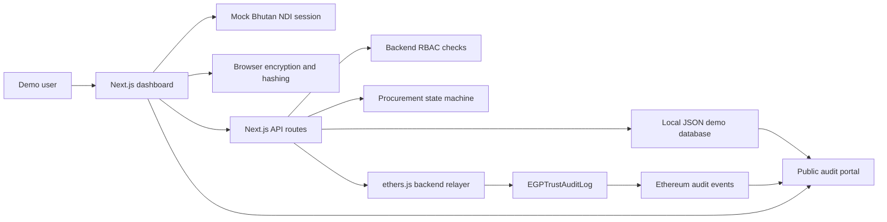

# Architecture Overview

The eGP Trust Layer is a middleware-style MVP. It keeps procurement workflow logic and encrypted proposal files off-chain, while Ethereum stores only proof events.

## Core Message

The eGP Trust Layer does not replace Bhutan's e-GP system. It adds blockchain-backed audit middleware that prevents hidden procurement manipulation by tying every critical action to verified employment identity, role-based authorization, workflow enforcement, and immutable Ethereum proof events.

## System Diagram

## Components

| Component | Path | Responsibility |
| --- | --- | --- |
| Next.js App Router UI | `frontend/app`, `frontend/components` | Dashboard, tender pages, proposal submission, evaluation, board voting, award, audit portal |
| Mock NDI and RBAC | `shared/src/mockBhutanNdiRbac.ts` | Demo users, roles, permissions, identity hashes |
| State machine | `backend/src/services/procurementStateMachine.ts` | Validates tender states, deadline locks, signatures, votes, and awards |
| Procurement API handler | `backend/src/api/procurementHandler.ts` | Handles tender, proposal, evaluation, board, award, and audit data operations |
| Relayer API handler | `backend/src/api/auditRelayerHandler.ts` | Validates role and actor hash, then submits Ethereum proof transactions |
| Relayer service | `backend/src/services/relayer.ts` | Uses ethers.js in mock or real mode |
| Local database | `backend/src/services/procurementDataStore.ts` | JSON-backed MVP data store |
| Audit transaction store | `backend/src/services/auditTransactionStore.ts` | JSON-backed transaction proof records |
| Contract | `contracts/contracts/EGPTrustAuditLog.sol` | Event-only proof log with authorized relayer writes |

## Data Flow

### Tender Creation

1. Procurement officer signs in through mock NDI.
2. Frontend calls `POST /api/tenders`.
3. Backend validates session and `CREATE_TENDER` permission.
4. State machine allows creation in `DRAFT`.
5. Backend creates a tender hash.
6. Relayer records `TenderCreated`.
7. Local audit event stores transaction hash and payload hash.

### Proposal Submission

1. Vendor enters four proposal sections.
2. Browser encrypts each section with AES-GCM.
3. Browser stores encrypted content locally for the demo.
4. Browser creates section hashes and a proposal manifest hash.
5. Frontend submits only encrypted envelope metadata.
6. Backend validates `OPEN` state and deadline.
7. Relayer records `ProposalSubmitted`.

### Evaluation

1. Tender moves to `EVALUATION` only after deadline and closure.
2. Assigned evaluators can decrypt and view proposal sections.
3. Each evaluator signs one recommendation.
4. Backend stores evaluator hash, comment hash, recommendation, timestamp, and signature hash.
5. Relayer records `EvaluationSigned`.

### Board Voting And Award

1. Tender moves to `BOARD_VOTING` only after 4 of 4 evaluator signatures.
2. Each assigned board member votes once.
3. Relayer records each `BoardVoteRecorded` event.
4. Officer declares the winner only after all board votes are complete.
5. The majority winner is recorded in `AwardDeclared`.

## On-Chain Boundary

Ethereum stores:

- tender hash
- proposal manifest hash
- stage change hash
- evaluation signature hash
- board vote hash
- award decision hash
- timestamps
- actor identity hashes

Ethereum does not store:

- plaintext proposal files
- decrypted proposal sections
- encryption keys
- vendor commercial details
- evaluator comments in plaintext
- raw employment IDs

## Demo Modes

| Mode | Configuration | Use |
| --- | --- | --- |
| Mock | `BLOCKCHAIN_MODE=mock` | Fast and reliable judging mode |
| Local blockchain | Hardhat node, local contract address, relayer private key | Local contract execution |
| Testnet | RPC URL, relayer key, deployed contract address | Sepolia or another EVM testnet |

## Trust Boundaries

- Browser handles encryption before proposal submission.
- Backend enforces role and state rules.
- Relayer wallet is the only writer to the contract.
- Contract emits events and avoids proposal file storage.
- Public audit exposes proof metadata only.
